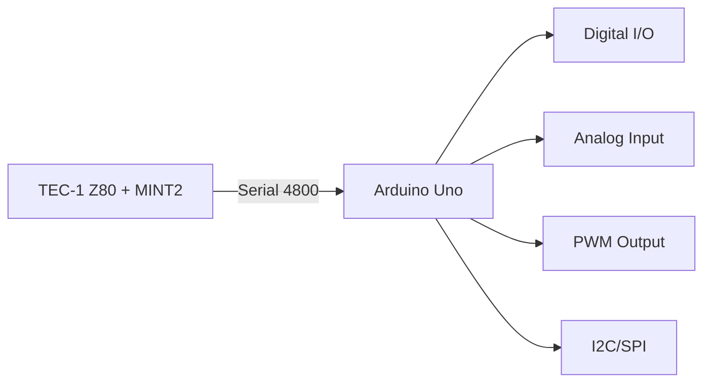

● I'll explain how you can use an Arduino Uno board with MINT to extend I/O and leverage AVR functions.

  Arduino Uno + MINT Integration Strategy

  Architecture Overview

  ┌─────────────────┐         Serial          ┌──────────────────┐
  │   TEC-1 Z80     │◄─────────────── ───────►│  Arduino Uno     │
  │   Running MINT  │    (TX/RX @ 4800)       │  (ATmega328P)    │
  │                 │                         │                  │
  │  - 4MHz Z80     │                         │  - 16MHz AVR     │
  │  - 2K-14K RAM   │                         │  - 32K Flash     │
  │  - Bit-bang     │                         │  - 2K SRAM       │
  │    serial       │                         │  - Hardware UART │
  └─────────────────┘                         └──────────────────┘
                                                        │
                                              ┌─────────┴─────────┐
                                              │                   │
                                           I/O Pins          Peripherals
                                           • Digital        • SPI
                                           • Analog         • I2C
                                           • PWM            • Servo

  Method 1: Serial Command Protocol

  The Arduino acts as an I/O coprocessor responding to MINT commands over serial.

  Arduino Firmware (Command Handler)

  // Arduino Uno firmware for MINT I/O extension
  // Compile and upload to Uno first

  #define CMD_DIGITALREAD   'R'
  #define CMD_DIGITALWRITE  'W'
  #define CMD_ANALOGREAD    'A'
  #define CMD_ANALOGWRITE   'P'  // PWM
  #define CMD_PINMODE       'M'
  #define CMD_SERVO         'S'
  #define CMD_I2C_READ      'I'
  #define CMD_I2C_WRITE     'J'
  #define CMD_SPI_XFER      'X'

  void setup() {
    Serial.begin(4800);  // Match TEC-1 bit-bang rate
    pinMode(LED_BUILTIN, OUTPUT);
  }

  void loop() {
    if (Serial.available()) {
      char cmd = Serial.read();

      switch(cmd) {
        case CMD_DIGITALREAD: {
          // Format: R<pin#>
          int pin = readNumber();
          int val = digitalRead(pin);
          Serial.print(val);
          Serial.print('\n');
          break;
        }

        case CMD_DIGITALWRITE: {
          // Format: W<pin#>,<value>
          int pin = readNumber();
          waitForChar(',');
          int val = readNumber();
          pinMode(pin, OUTPUT);
          digitalWrite(pin, val);
          Serial.print("OK\n");
          break;
        }

        case CMD_ANALOGREAD: {
          // Format: A<pin#>
          int pin = readNumber();
          int val = analogRead(pin);
          Serial.print(val);
          Serial.print('\n');
          break;
        }

        case CMD_ANALOGWRITE: {
          // Format: P<pin#>,<value>
          int pin = readNumber();
          waitForChar(',');
          int val = readNumber();
          pinMode(pin, OUTPUT);
          analogWrite(pin, val);
          Serial.print("OK\n");
          break;
        }

        case CMD_PINMODE: {
          // Format: M<pin#>,<mode>  (0=INPUT, 1=OUTPUT, 2=INPUT_PULLUP)
          int pin = readNumber();
          waitForChar(',');
          int mode = readNumber();
          pinMode(pin, mode == 0 ? INPUT : (mode == 1 ? OUTPUT : INPUT_PULLUP));
          Serial.print("OK\n");
          break;
        }
      }
    }
  }

  int readNumber() {
    int num = 0;
    while(Serial.available()) {
      char c = Serial.read();
      if (c >= '0' && c <= '9') {
        num = num * 10 + (c - '0');
      } else {
        break;
      }
      delay(1);  // Allow more chars to arrive
    }
    return num;
  }

  void waitForChar(char target) {
    while(Serial.available() == 0);
    Serial.read();  // Consume the character
  }

  MINT Functions for Arduino Control

  // MINT functions to control Arduino Uno
  // Upload these to your TEC-1 running MINT

  // Send digital write command: pin value W
  :W
    w ! p !                    // Pop value and pin
    `W` p . `,` w . /N         // Send "W<pin>,<value>\n"
  ;

  // Read digital pin: pin R -- value
  :R
    `R` " . /N                 // Send "R<pin>\n"
    0 v !                      // Clear result
    /U (                       // Loop to read response
      /K d !                   // Read character
      d 48 >= d 57 <= && (     // If digit
        v 10 * d 48 - + v !    // Build number
      ) /E (
        d 10 = /W              // Exit on newline
      )
    )
    v                          // Push result
  ;

  // Read analog pin: pin A -- value (0-1023)
  :A
    `A` " . /N                 // Send "A<pin>\n"
    0 v !                      // Clear result
    /U (                       // Loop to read response
      /K d !
      d 48 >= d 57 <= && (
        v 10 * d 48 - + v !
      ) /E (
        d 10 = /W
      )
    )
    v
  ;

  // Set PWM: pin value P
  :P
    w ! p !
    `P` p . `,` w . /N
  ;

  // Set pin mode: pin mode M (0=IN, 1=OUT, 2=PULLUP)
  :M
    m ! p !
    `M` p . `,` m . /N
  ;

  Method 2: Memory-Mapped I/O Protocol

  For faster communication, use a binary protocol with fixed packet structure:

  Arduino Firmware (Binary Protocol)

  // Packet format: [CMD:1][PIN:1][VALUE:2]
  struct Packet {
    uint8_t cmd;
    uint8_t pin;
    uint16_t value;
  };

  void loop() {
    if (Serial.available() >= 4) {
      Packet pkt;
      pkt.cmd = Serial.read();
      pkt.pin = Serial.read();
      pkt.value = Serial.read() << 8;  // High byte
      pkt.value |= Serial.read();      // Low byte

      uint16_t result = 0;

      switch(pkt.cmd) {
        case 0x01:  // Digital Read
          result = digitalRead(pkt.pin);
          break;
        case 0x02:  // Digital Write
          digitalWrite(pkt.pin, pkt.value);
          break;
        case 0x03:  // Analog Read
          result = analogRead(pkt.pin);
          break;
        case 0x04:  // PWM Write
          analogWrite(pkt.pin, pkt.value);
          break;
      }

      // Send response: [result high][result low]
      Serial.write((result >> 8) & 0xFF);
      Serial.write(result & 0xFF);
    }
  }

  MINT Binary Protocol Functions

  // Binary protocol for faster communication

  // Send 4-byte packet and read 2-byte response
  :U
    v ! p ! c !                // Pop value, pin, command
    c /C                       // Send command byte
    p /C                       // Send pin byte
    v 8 } #FF & /C            // Send value high byte
    v #FF & /C                // Send value low byte
    /K 8 { /K + r !           // Read 2-byte response
    r                         // Return result
  ;

  // Digital write: pin value DW
  :DW
    2 U '                     // Command 2, discard response
  ;

  // Digital read: pin DR -- value
  :DR
    0 1 U                     // Command 1, value 0
  ;

  // Analog read: pin AR -- value
  :AR
    0 3 U                     // Command 3, value 0
  ;

  // PWM write: pin value PW
  :PW
    4 U '                     // Command 4, discard response
  ;

  Method 3: SPI/I2C Slave Mode

  Use Arduino as an SPI/I2C slave device for maximum speed (requires hardware interface on TEC-1).

  Practical Examples

  Example 1: Read Temperature Sensor

  // Arduino A0 connected to LM35 temperature sensor
  :TEMP
    0 A                       // Read analog pin 0
    5 * 1024 /               // Convert to voltage (0-5V)
    100 *                     // LM35: 10mV/°C = 100°C/V
    t !                       // Store temperature
    `Temperature: ` t . `C` /N
  ;

  // Run every second
  :MONITOR
    10 ( TEMP 100 ( 100 ( ) ) ) // 10 readings, 1 sec apart
  ;

  Example 2: Control LED Strip (PWM)

  // Fade LED on Arduino pin 9
  :FADE
    256 (
      9 /i P                  // Set PWM on pin 9
      50 ( )                  // Delay
    )
    256 (
      9 255 /i - P            // Fade down
      50 ( )
    )
  ;

  // Run fade loop
  :DEMO
    /U ( FADE )               // Infinite fade
  ;

  Example 3: Read Multiple Sensors

  // Read 4 analog sensors and display
  :SENSORS
    [0 0 0 0] s !             // Array for 4 sensors
    4 (
      /i A                    // Read analog pin i
      s /i ?!                 // Store in array
    )

    // Display results
    `A0:` s 0? . ` A1:` s 1? . ` A2:` s 2? . ` A3:` s 3? . /N
  ;

  // Monitor continuously
  :MON
    /U ( SENSORS 100(100()) ) // Update every ~1 sec
  ;

  Hardware Connection

  TEC-1                    Arduino Uno
  ─────                    ───────────
  TX (bit-bang) ────────► RX (Pin 0)
  RX (bit-bang) ◄──────── TX (Pin 1)
  GND ──────────────────── GND

  Important Notes:
  - TEC-1 runs 0-5V TTL logic (compatible with Uno)
  - Use 4800 baud to match TEC-1 bit-bang timing
  - Add 100Ω series resistors for protection
  - Common ground is essential

  Advanced Functions

  Servo Control

  // Arduino side
  #include <Servo.h>
  Servo servo1;

  case CMD_SERVO: {
    // Format: S<pin#>,<angle>
    int pin = readNumber();
    waitForChar(',');
    int angle = readNumber();
    servo1.attach(pin);
    servo1.write(angle);
    Serial.print("OK\n");
    break;
  }

  // MINT side - Control servo
  :SERVO
    a ! p !                   // Pop angle and pin
    `S` p . `,` a . /N       // Send command
  ;

  // Sweep servo
  :SWEEP
    180 (
      9 /i SERVO              // Pin 9, angle 0-179
      50 ( )                  // Delay
    )
  ;

  Benefits of This Approach

  1. Extended I/O: 20 GPIO pins (vs limited TEC-1 I/O)
  2. Analog Input: 6 ADC channels (10-bit resolution)
  3. PWM Output: 6 hardware PWM channels
  4. Modern Peripherals: SPI, I2C, UART built-in
  5. Sensor Libraries: Leverage Arduino ecosystem
  6. Computation: 16MHz AVR can handle complex math
  7. Timing: Hardware timers for precise timing

  This creates a powerful hybrid system where MINT provides high-level control logic while Arduino handles real-time I/O and interfacing!

────────────────────────────────────────────────────────────────────────────────────────────────────────────────────────────────────────────────────────────────
>  

was this for mint2-tec1 or mint_octave ? 

● Good question! My explanation was primarily for MINT2-TEC1 (the Z80 hardware version running on the TEC-1).

  Let me clarify the distinction:

  For MINT2-TEC1 (Z80 Hardware)

  This is what I described above - Arduino Uno as I/O expansion:

  ┌─────────────────┐    Serial 4800    ┌──────────────────┐
  │   TEC-1 Z80     │◄─────────────────►│  Arduino Uno     │
  │   MINT2         │   (bit-bang)      │  (ATmega328P)    │
  │   4MHz, 2-14K   │                   │  Extended I/O    │
  └─────────────────┘                   └──────────────────┘

  - Uses /K (read char) and /C (write char) for serial communication
  - Arduino acts as I/O coprocessor
  - Real hardware limitation: 4800 baud bit-bang serial

  ---
  For MINT-Octave (Software Simulator)

  MINT-Octave runs inside Octave/MATLAB on a PC - it doesn't need Arduino for I/O because:

  1. It already has full PC capabilities:
    - Can use Octave's built-in functions
    - Direct file I/O
    - Graphics with plot(), surf()
    - Full math library
  2. If you wanted Arduino integration with MINT-Octave, you'd use Octave's serial package:

  % In MINT-Octave modified code
  pkg load instrument-control
  s = serial("/dev/ttyUSB0", 9600);  % Or COM port on Windows

  % Then modify MINT /K and /C to use:
  % fread(s, 1)  for reading
  % fwrite(s, data) for writing

  But this is much less useful because Octave can already do everything Arduino does (and more).

  ---
  Practical Use Cases

  MINT2-TEC1 + Arduino Uno ✅

  Best for: Real embedded systems
  - TEC-1 has limited I/O (8-bit data bus, few ports)
  - Arduino adds 20 GPIO, 6 ADC, PWM, I2C, SPI
  - Real-world interfacing: sensors, motors, displays
  - Example: TEC-1 runs control logic, Arduino handles sensors

  MINT-Octave + Arduino ❓

  Less useful because:
  - Octave already runs on a full PC
  - PC has USB, network, storage, graphics
  - Only needed if you specifically want to test Arduino code from MINT syntax
  - Better to just use Octave's Arduino package directly

  ---
  Summary Table

  | Feature  | MINT2-TEC1 + Uno       | MINT-Octave + Uno               |
  |----------|------------------------|---------------------------------|
  | Purpose  | Extend limited Z80 I/O | Unnecessary (PC has everything) |
  | Serial   | 4800 baud bit-bang     | USB serial (high speed)         |
  | Use Case | Embedded systems       | Development/testing only        |
  | Value    | ⭐⭐⭐⭐⭐ High             | ⭐ Low                           |

  ---
  So to directly answer your question: My explanation was for MINT2-TEC1, where Arduino integration makes real practical sense for I/O expansion.

  Would you like me to create:
  1. A complete working Arduino sketch for TEC-1 integration?
  2. Or explain how to modify MINT-Octave to talk to Arduino (though less useful)?
  3. Or help set up actual hardware for the uno directory I see in your project?


> But this is much less useful because Octave can already do everything Arduino does (and more).---explain 

● Great question! Let me explain why using Arduino with MINT-Octave is less useful than you might think.

  The Key Difference: Where the Code Runs

  MINT2-TEC1 (Real Hardware)

  ┌─────────────────────────────────────┐
  │  Physical TEC-1 Computer            │
  │  ├─ Z80 CPU @ 4MHz                  │
  │  ├─ 2-14K RAM                       │
  │  ├─ Limited I/O (data bus only)     │
  │  └─ No floating point, no USB, etc. │
  └─────────────────────────────────────┘
           ↓
      NEEDS Arduino for:
      - More GPIO pins
      - Analog input (ADC)
      - Modern protocols (I2C, SPI)
      - Sensors, actuators

  MINT-Octave (Software Simulator)

  ┌──────────────────────────────────────────────┐
  │  Your PC/Laptop                              │
  │  ├─ Modern CPU @ 2-4GHz                      │
  │  ├─ 8-16GB RAM                               │
  │  ├─ USB, Network, Graphics, Sound            │
  │  ├─ Can run Octave/MATLAB                    │
  │  └─ Can ALREADY talk to Arduino via USB      │
  └──────────────────────────────────────────────┘
           ↓
      Arduino adds NOTHING new
      Everything is already available!

  What Octave Can Already Do

  1. Hardware Access (Better than Arduino)

  % Octave can directly access hardware via packages
  pkg load instrument-control

  % Talk to ANY Arduino board
  arduino = arduino("/dev/ttyUSB0");  % or "COM3" on Windows

  % Direct pin control
  writeDigitalPin(arduino, 'D13', 1);
  voltage = readVoltage(arduino, 'A0');

  % Much easier than going through MINT!

  2. Advanced I/O (Far beyond Arduino)

  % File I/O
  data = load("sensors.csv");
  save("output.txt", "results");

  % Network communication
  urlread("http://api.weather.com/data");

  % Graphics (Arduino can't do this at all!)
  plot(time, temperature);
  surf(X, Y, Z);
  imshow(camera_image);

  % Sound
  sound(waveform, 44100);

  3. Computation (Thousands of times faster)

  % Matrix operations (instant on PC, impossible on Arduino)
  A = rand(1000, 1000);
  B = rand(1000, 1000);
  C = A * B;  % Billions of operations in milliseconds

  % Arduino: 16MHz, no FPU
  % Your PC: 3000MHz, with FPU, with vector instructions
  % Speed difference: ~1000x for math operations

  4. Real Sensors via USB (No Arduino needed)

  % Many sensors have USB interfaces
  % Connect directly to PC:

  % USB oscilloscope
  scope = serial("/dev/ttyUSB0");

  % USB cameras
  cam = videoinput("webcam");
  frame = getsnapshot(cam);

  % USB GPS, accelerometers, multimeters, etc.
  % All accessible directly from Octave

  Why Use Arduino with MINT-Octave? (Rarely useful)

  There are only a few niche cases:

  Case 1: Testing MINT Code for Future TEC-1 Use

  // Develop Arduino control code in MINT-Octave
  // Then transfer to real TEC-1 hardware later

  :SENSOR
    0 A                    // Read analog 0
    100 /                  // Scale
    t !                    // Store temperature
  ;

  // Test in MINT-Octave first
  // Deploy to TEC-1 later when hardware ready

  Case 2: Teaching/Learning Protocol Design

  // Learn how to design serial protocols
  // Before committing to real hardware

  :PACKET
    #AA /C                 // Send header
    13 /C                  // Send pin number
    /K r !                 // Read response
  ;

  Case 3: Arduino Has Specialized Shield

  If Arduino has a specific shield:
  - Motor controller
  - RF transceiver
  - CAN bus interface

  And you want to control it from MINT syntax
  (But still, you'd normally just use Octave directly)

  Direct Comparison Example

  Let's say you want to read a temperature sensor and plot the data:

  Option A: MINT-Octave → Arduino → Sensor ❌ (Inefficient)

  PC running MINT-Octave
    ↓ (USB serial)
  Arduino
    ↓ (analog pin)
  Temperature Sensor
    ↓ (send data back via serial)
  Arduino
    ↓ (USB serial)
  PC (now must parse and plot)

  Problems:
  - Extra latency (USB round-trip)
  - Extra power (Arduino needs power)
  - Extra complexity (two programs: MINT + Arduino sketch)
  - Lower bandwidth (serial bottleneck)

  Option B: Octave → Sensor directly ✅ (Better)

  PC running Octave
    ↓ (USB directly)
  USB Temperature Sensor
    ↓ (instant data)
  PC (plot immediately)

  Or even better:

  Option C: Octave → Arduino with native package ✅ (Best)

  % Use Octave's Arduino package directly
  pkg load arduino

  a = arduino();
  temp = readVoltage(a, 'A0') * 100;  % LM35 sensor
  plot(time, temp);

  % No MINT layer needed!
  % Faster, simpler, more powerful

  When Arduino + MINT-Octave WOULD Be Useful

  Imagine you're building a real TEC-1 system but want to develop the code first:

  Development Phase (Safe, Fast):
    MINT-Octave on PC
      ↓
    Arduino (representing future TEC-1 I/O)
      ↓
    Real sensors/actuators

  Deployment Phase (Final Hardware):
    MINT2 on TEC-1
      ↓
    Arduino (actual I/O expander)
      ↓
    Same sensors/actuators

  This way you can:
  1. Develop MINT code on PC (with debugging, logging)
  2. Test with real hardware (Arduino + sensors)
  3. Deploy exact same MINT code to TEC-1

  The Bottom Line

  | Task            | MINT-Octave + Arduino | Pure Octave  | Winner      |
  |-----------------|-----------------------|--------------|-------------|
  | Read sensor     | Possible but slow     | Fast, direct | Octave      |
  | Math/science    | Same (Octave does it) | Same         | Tie         |
  | Graphics/plot   | Same (Octave does it) | Same         | Tie         |
  | File I/O        | Same (Octave does it) | Same         | Tie         |
  | Learning MINT   | Yes, good for this    | N/A          | MINT-Octave |
  | Deploy to TEC-1 | Good for prototyping  | Can't deploy | MINT-Octave |

  MINT-Octave's real purpose is:
  - ✅ Learning MINT language safely on PC
  - ✅ Developing code for future TEC-1 deployment
  - ✅ Fast prototyping with better debugging
  - ✅ Handling floating-point math (TEC-1 can't)

  NOT:
  - ❌ Adding capabilities to Octave (it has everything)
  - ❌ Making Arduino more powerful (PC is already better)

  ---
  Does this clarify why the Arduino integration is more valuable for the real hardware TEC-1 than for the software simulator MINT-Octave?

  Would you like me to show you what's actually in your uno/ directory to see what integration you might already have started?

///////////////////////////////////////////////


                                                                                                                                                                          
# Commentary on the Arduino-MINT Integration Discussion                                                                                                                     

This is a thorough and well-structured response. Let me offer some technical observations, critique the code, and highlight what's missing or potentially problematic.

## What's Solid

- **Architectural separation of concerns**: MINT handles control logic, Arduino handles I/O. This is a sensible design for the TEC-1's constrained Z80.
- **The 4800 baud limitation** is correctly identified as the bottleneck. The TEC-1's bit-bang serial is the ceiling here, not the ATmega328P.
- **The MINT-Octave comparison** is accurate — going through MINT to reach Arduino when Octave already has a native `arduino` package is indeed wasted effort.
- **The three-tier approach** (text → binary → SPI/I²C) is the right progression in terms of complexity vs. throughput.

## Code Issues to Flag

### Arduino sketch

```cpp
int readNumber() {
  int num = 0;
  while(Serial.available()) {
    char c = Serial.read();
    if (c >= '0' && c <= '9') {
      num = num * 10 + (c - '0');
    } else {
      break;  // ⚠ Silently discards non-digit
    }
    delay(1);
  }
  return num;
}
```

Several problems:

1. **No terminator protocol** — how does the sender know the number ended? The `break` discards a character the sender intended to be meaningful (e.g., the `,` 
separator). It works *only* because the sender is also slow.
2. **No timeout** — if a character is lost, `delay(1)` may be too short or too long depending on baud rate.
3. **No bounds checking** — `digitalRead(pkt.pin)` with `pkt.pin = 200` will silently return garbage on Uno (where max is A5 = 19).
4. **Mixed single/double quotes** — `'R'` vs `“R”` appears inconsistently. In the source you posted, `case CMD_DIGITALREAD:` uses `'R'` (correct), but later 
`Serial.print("OK\n")` mixes both — make sure the file is pure ASCII.

The `waitForChar()` function reads *any* character and discards it without verifying it matches the target. This is a silent failure mode.

### MINT side

The binary protocol word `:U` does this:

```mint
v 8 } #FF & /C   // Send value high byte
```

If `8 }` is a logical right-shift by 8, this is correct for the high byte. But the syntax is ambiguous without knowing the MINT2 spec. Worth verifying against the 
actual MINT2-TEC1 reference (the original MINT2 by Jager & Dentry uses `8 SHR` or similar — I don't have it in front of me to confirm `}`).

The repeated loops in `:A` and `:R` are nearly identical — factor them out:

```mint
:NUM ( -- n )  0 v !  /U ( /K d ! d 48 >= d 57 <= && ( v 10 * d 48 - + v ! ) /E ( d 10 = /W ) ) v ;
:AR  ( pin -- n )  A " . /N NUM ;
:DR  ( pin -- n )  R " . /N NUM ;
```

## What's Missing

1. **Flow control / framing**: The text protocol has no framing — how do you distinguish the value `12` from `1,2` if a comma is dropped? A proper protocol needs a 
length field, a terminator that can't appear in payloads, or escaping. The binary protocol at least has a fixed 4-byte packet structure, which is better.

2. **Checksums/CRC**: Especially for the binary protocol, even a simple XOR or sum-check catches bit errors from noisy environments.

3. **Error responses**: What if `digitalRead` is called on an analog-only pin (A6/A7 on Uno are analog-input-only)? The Arduino should respond with a distinct error 
code, not echo a stale value.

4. **Latency math**: At 4800 baud, one byte is ~2ms. The text command `W13,1\n` is 5 bytes = 10ms one-way, 20ms round-trip. The analog read response (`A0\n` → 
`523\n`) is another 20ms. The PWM fade example at 50ms per step is dominated by serial, not by `analogWrite`. Worth noting in any "is this fast enough?" discussion.

5. **The 100Ω series resistor claim**: This is a bit hand-wavy. For 5V TTL-to-5V TTL with short cables, it's unnecessary. If the concern is protecting the Arduino's 
RX pin from the TEC-1's TX (which is just 5V logic), a 1kΩ would be more typical, but neither is needed unless there's a specific failure mode in mind. I'd drop this 
or explain the actual reason.

6. **TEC-1 variant concerns**: The original TEC-1A has no hardware serial at all — the bit-bang is in MINT2 itself. Later versions with the 6850 ACIA have proper 
serial. The integration strategy differs:
   - **ACIA-equipped TEC-1**: Higher baud rates possible (9600, even 19200), interrupt-driven on receive
   - **Bit-bang TEC-1**: Locked to ~4800 because the Z80 has to spin-wait bit-by-bit

7. **The 6850 ACIA** specifically: it's at I/O port `0x80` typically, and MINT2 has `/E` (read ACIA) and `/D` (write ACIA). If the user has an ACIA, the bit-bang code 
can be replaced with hardware serial at much higher rates. This is a major upgrade path the discussion doesn't mention.

8. **Power and ground**: A real concern. The Arduino should be powered from the same supply as the TEC-1 if possible, or at least share a robust common ground. 
USB-powered Arduino + battery-powered TEC-1 can have ground loops.

## On the MINT-Octave Discussion

The conclusion is correct but a little dismissive. There *is* a legitimate use case the discussion under-emphasizes:

> Develop MINT code on PC (MINT-Octave) using an Arduino as a real-world I/O target, then deploy the same MINT code to a real TEC-1.

This is genuinely useful for **iterative development** — you get:
- Source-level debugging in Octave
- Real sensor I/O via Arduino (since Octave's `arduino` package works great)
- Identical MINT syntax between dev and deploy
- A clear migration path

The discussion touches on this ("Case 1: Testing MINT Code for Future TEC-1 Use") but buries it. It's actually the strongest argument for the combination.

## My Recommendations

If you're going to implement this, I'd suggest:

1. **Start with binary protocol** — it's not much more code than text and is dramatically more robust
2. **Add a 5th byte: length or checksum** — for the binary protocol
3. **Use a state machine on the Arduino side** — `setup()` does init, `loop()` parses a complete packet before responding, not byte-by-byte
4. **If your TEC-1 has the 6850 ACIA**, use it — go to 9600 or 19200 baud
5. **Wrap the MINT words in a vocab/module** — group them in a file like `arduino.mint` for reusability
6. **Test the analog math on paper first** — the LM35 example is right, but an LM335 (10mV/°K) or TMP36 (10mV/°C with 0.5V offset) would silently give wrong results

## What I Don't Know

- Which TEC-1 variant you have (with/without ACIA, RAM size, clock speed)
- Whether your `uno/` directory contains actual code (the previous AI offered to look at it — did you share it?)
- Whether you want to do this for a project, a class, or general exploration

Happy to go deeper on any of these — particularly the ACIA upgrade path or a concrete state-machine implementation of the Arduino side.

>>> show me a flowchart ascii of all of this ; give me a picture
I can't generate images — I can only produce text. Let me give you a detailed ASCII flowchart instead, then show you how to render it as an actual picture.

# Arduino-MINT Integration: Full ASCII Flowchart

## 1. Overall System Architecture

```
┌──────────────────────────────────────────────────────────────────────────────┐
│                          SYSTEM ARCHITECTURE                                 │
│                                                                              │
│   ┌─────────────────────────┐                ┌──────────────────────────┐    │
│   │     TEC-1 (Z80)         │                │    ARDUINO UNO           │    │
│   │  ┌─────────────────┐    │                │   ┌──────────────────┐   │    │
│   │  │   MINT2         │    │  4800 BAUD     │   │   ATmega328P     │   │    │
│   │  │   FORTH-LIKE    │    │  SERIAL  TX/RX │   │   16 MHz         │   │    │
│   │  │   INTERPRETER   │◄───┼────────────────┼──►│                  │   │    │
│   │  │                 │    │                │   │  ┌────────────┐  │   │    │
│   │  │  /K = read char │    │                │   │  │   CMD      │  │   │    │
│   │  │  /C = write chr │    │                │   │  │  PARSER    │  │   │    │
│   │  └─────────────────┘    │                │   │  └─────┬──────┘  │   │    │
│   │           │             │                │   │        │         │   │    │
│   │  4 MHz    ▼             │                │   │        ▼         │   │    │
│   │  2-14K    ┌──────────┐  │                │   │   ┌────────┐     │   │    │
│   │  RAM      │ BIT-BANG │  │                │   │   │ I/O    │     │   │    │
│   │  8-bit    │  SERIAL  │  │                │   │   │ PINS   │     │   │    │
│   │           └──────────┘  │                │   │   │  A0-A5 │     │   │    │
│   └─────────────────────────┘                │   │   │  D0-D13│     │   │    │
│                                              │   │   │  PWM   │     │   │    │
│                                              │   │   │  I2C   │     │   │    │
│                                              │   │   │  SPI   │     │   │    │
│                                              │   │   └────────┘     │   │    │
│                                              │   └──────────────────┘   │    │
│                                              └──────────────────────────┘    │
│                                          │                                  │
│                                          ▼                                  │
│                    ┌──────────┬──────────┬──────────┬──────────┐             │
│                    │  SENSORS │  LEDS    │  MOTORS  │ DISPLAYS │             │
│                    │  LM35    │  PWM     │  SERVOS  │  OLED    │             │
│                    │  DHT22   │  RGB     │  STEPPER │  LCD     │             │
│                    │  BMP280  │          │  RELAYS  │          │             │
│                    └──────────┴──────────┴──────────┴──────────┘             │
└──────────────────────────────────────────────────────────────────────────────┘
```

## 2. Three Integration Methods (Decision Tree)

```
                    ┌──────────────────────────────┐
                    │  CHOOSE INTEGRATION METHOD   │
                    └──────────────┬───────────────┘
                                   │
                                   ▼
                    ┌──────────────────────────────┐
                    │  Need simplest possible?      │
                    │  (Debugging / Learning)       │
                    └──────────┬───────────────────┘
                              │ YES                  NO
                              ▼                       ▼
              ┌────────────────────────┐   ┌────────────────────────────┐
              │ METHOD 1:              │   │  Need reasonable speed?     │
              │ TEXT PROTOCOL          │   │  (Default choice)          │
              │                        │   └──────────┬─────────────────┘
              │ • Human readable       │              │ YES                NO
              │ • Slow (4800 baud)     │              ▼                     ▼
              │ • Easy to debug        │   ┌────────────────────┐  ┌────────────────────┐
              │ • No ACIA required     │   │ METHOD 2:          │  │ METHOD 3:          │
              └────────────────────────┘   │ BINARY PROTOCOL    │  │ SPI / I2C SLAVE    │
                                          │                    │  │                    │
                                          │ • Fixed 4-byte     │  │ • Maximum speed    │
                                          │   packets          │  │ • Hardware bus     │
                                          │ • 2-byte response  │  │ • Needs ACIA + SPI │
                                          │ • 3-5x faster      │  │   on TEC-1         │
                                          │ • Still ACIA-      │  │ • Most complex     │
                                          │   compatible       │  │                    │
                                          └────────────────────┘  └────────────────────┘
```

## 3. Method 1: Text Protocol (Detailed)

```
  MINT SIDE (TEC-1)                          ARDUINO SIDE
  ─────────────────                          ────────────
       │                                          │
       │  User types:  :BLINK  13 1 W ;           │
       │                                          │
       ▼                                          │
  ┌──────────┐                                    │
  │  Parse   │  "13 1 W"                          │
  │  Stack:  │  → push 13, push 1                 │
  │  13 1    │                                    │
  └────┬─────┘                                    │
       │                                          │
       ▼                                          │
  ┌──────────────┐    ASCII bytes:    ┌──────────────────┐
  │  /C  "W"     │──────────────────► │  Serial.read()   │
  │  /C  ","     │   W,13,1\n         │  cmd = 'W'       │
  │  emit digits │                   │                  │
  │  /C  "\n"    │                   │  ┌────────────┐  │
  └──────────────┘                   │  │ PIN MODE?  │  │
                                     │  └─────┬──────┘  │
                                     │        ▼         │
                                     │  readNumber()    │
                                     │        │         │
                                     │        ▼         │
                                     │  readNumber()    │
                                     │        │         │
                                     │        ▼         │
                                     │  pinMode(13,OUT) │
                                     │  digitalWrite()  │
                                     │        │         │
                                     │        ▼         │
                                     │  Serial.print()  │
                                     │  "OK\n"          │
                                     └────────┬─────────┘
                                              │
                                              ▼
  ┌──────────────┐    "OK\n"          ┌──────────────────┐
  │  /K loop     │◄──────────────────│                  │
  │  read chars  │                   │                  │
  │  until \n    │                   │                  │
  └──────────────┘                   └──────────────────┘
       │
       ▼
   Next word
```

## 4. Method 2: Binary Protocol Packet Flow

```
  MINT SIDE                              ARDUINO SIDE
  ─────────                              ────────────
       │                                        │
       │  :DW  2 U                              │  START
       │  push cmd=2, push pin=13, push val=1   │  Packet: [0x02][0x0D][0x00][0x01]
       │                                        │
       ▼                                        │
  ┌────────────┐                                │
  │  Pack 4    │                                │
  │  bytes:    │                                │
  │  1: CMD    │────[02]───────────────────────►│  byte 0 → pkt.cmd
  │  2: PIN    │────[0D]───────────────────────►│  byte 1 → pkt.pin
  │  3: VAL_HI │────[00]───────────────────────►│  byte 2 → pkt.value high
  │  4: VAL_LO │────[01]───────────────────────►│  byte 3 → pkt.value low
  └────────────┘                                │
       │                                        ▼
       │                                 ┌──────────────┐
       │                                 │ pkt.cmd=0x02 │
       │                                 │ → digitalWrite│
       │                                 └──────┬───────┘
       │                                        │
       │   Response: [00][00]                   ▼
       │   (2 bytes)                    ┌──────────────┐
       │                                │ Serial.write │
       │                                │ high, low    │
       │◄──────────────[00][00]─────────┴──────────────┘
       ▼
  ┌────────────┐
  │  Read 2    │
  │  bytes     │
  │  combine:  │
  │  hi<<8 | lo │
  │  r !        │
  └────────────┘
       │
       ▼
  pop result (0x0000 = OK)
```

## 5. Arduino Firmware State Machine

```
                              ┌──────────────┐
                              │  setup()     │
                              │  Serial      │
                              │  begin 4800  │
                              │  pinModes    │
                              └──────┬───────┘
                                     │
                                     ▼
                       ╔═════════════════════════╗
                       ║    loop()  MAIN LOOP    ║
                       ╚════════════╤════════════╝
                                    │
                       ┌────────────┴────────────┐
                       │  Serial.available()?    │
                       └────────────┬────────────┘
                                    │
                              ┌─────┴─────┐
                              │  ≥ 4 ?    │──── NO ──► (idle)
                              └─────┬─────┘
                                    │ YES
                                    ▼
                        ┌──────────────────────┐
                        │  READ PACKET         │
                        │  cmd = read()        │
                        │  pin = read()        │
                        │  val = read()<<8     │
                        │      | read()        │
                        └──────────┬───────────┘
                                   │
                                   ▼
                        ╔══════════════════════╗
                        ║  SWITCH on cmd byte   ║
                        ╚══════════╤═══════════╝
                                   │
       ┌───────────┬───────────────┼───────────────┬───────────┐
       │           │               │               │           │
       ▼           ▼               ▼               ▼           ▼
   ┌───────┐  ┌───────┐      ┌────────┐      ┌────────┐  ┌────────┐
   │ 0x01  │  │ 0x02  │      │  0x03  │      │  0x04  │  │ OTHER  │
   │DIGRD  │  │DIGWR  │      │ ANARD  │      │ PWM WR │  │ ERROR  │
   └───┬───┘  └───┬───┘      └───┬────┘      └───┬────┘  └───┬────┘
       │          │              │               │            │
       ▼          ▼              ▼               ▼            ▼
   digitalRead  digitalWrite  analogRead     analogWrite   send ERR
       │          │              │               │            │
       └──────────┴──────┬───────┴───────────────┴────────────┘
                          │
                          ▼
                ┌─────────────────────┐
                │  BUILD RESPONSE     │
                │  result_hi, result_lo│
                │  Serial.write(hi)   │
                │  Serial.write(lo)   │
                └──────────┬──────────┘
                           │
                           ▼
                      (back to top)
```

## 6. MINT Code Flow (Example: Read Analog)

```
  User types:  0 AR .
       │
       ▼
  ┌─────────────┐
  │  Push 0     │  (pin number)
  │  onto stack │
  └──────┬──────┘
         │
         ▼
  ┌──────────────────────────────────────┐
  │  :AR  ( pin -- n )                  │
  │     A " . /N   ← send "A0\n"        │
  │     NUM        ← read decimal reply │
  │  ;                                  │
  └──────┬───────────────────────────────┘
         │
         │  Sends ASCII:  A 0 \n
         │  (4 bytes @ 4800 baud = ~8.3 ms)
         │
         ▼
  ┌──────────────────────────────────────┐
  │  :NUM  ( -- n )                     │
  │     0 v !                            │
  │     BEGIN                           │
  │       /K d !                         │
  │       d 48 >= d 57 <= AND IF        │
  │         v 10 * d 48 - + v !         │
  │       ELSE                          │
  │         d 10 = IF W THEN            │ ← exit on \n
  │       THEN                          │
  │     AGAIN                           │
  │     v ;                             │
  └──────┬───────────────────────────────┘
         │
         │  Arduino responds:  5 2 3 \n
         │  Accumulates: 0 → 5 → 52 → 523
         │
         ▼
  ┌──────────────┐
  │  Stack: 523  │
  │  . prints   │
  │  "523"      │
  └──────────────┘
```

## 7. Hardware Wiring

```
              TEC-1 (Bit-Bang)             ARDUINO UNO
              ────────────────             ───────────
                                          
              ┌──────────────┐             ┌──────────────┐
              │              │             │              │
   TX out ────┤  (serial TX) ├────[100Ω]──►├ RX  (D0)     │
              │              │   (opt.)    │              │
   RX in  ◄───┤  (serial RX) ├────[100Ω]───┤ TX  (D1)     │
              │              │   (opt.)    │              │
              │              │             │              │
              │    GND       ├─────────────┤ GND          │
              │              │             │              │
              └──────────────┘             └──────┬───────┘
                                                 │
                                                 ▼
                                  ┌──────────────────────────┐
                                  │   ARDUINO I/O HEADERS    │
                                  ├──────────────────────────┤
                                  │  D2-D13  →  Digital I/O  │
                                  │  A0-A5   →  Analog In    │
                                  │  ~3,~5,~6,~9,~10,~11     │
                                  │           →  PWM Out     │
                                  │  SDA/A4, SCL/A5 → I2C   │
                                  │  D11-D13 → SPI          │
                                  └──────────────────────────┘
```

## 8. Full Request/Response Cycle (Timing)

```
  TIME   TEC-1                              ARDUINO
  ────   ─────                              ──────
  0ms    [Push pin, cmd, val]               
  1ms    [Pack 4 bytes]                     
  2ms    [Send byte 0: CMD]     ────────────►
  4ms    [Send byte 1: PIN]     ────────────►
  6ms    [Send byte 2: VAL_HI]  ────────────►
  8ms    [Send byte 3: VAL_LO]  ────────────►
                                       [Receive 4 bytes complete]
                                       [Parse packet]
                                       [Execute command]
                                       [Prepare response]
  10ms   [Read byte 0]          ◄────────────  [Send response hi]
  12ms   [Read byte 1]          ◄────────────  [Send response lo]
  14ms   [Combine → result]
  15ms   [Pop result, continue]
                                                
  TOTAL: ~15ms per binary transaction
  TEXT:  ~25-30ms per text transaction
  DIRECT I2C @ 100kHz: ~0.5ms (with ACIA + hardware)
```

---

# How to Render This as an Actual Picture

Pick whichever fits your tools:

**1. Mermaid (renders in GitHub, VS Code, many wikis)**

Save the text inside a fenced `mermaid` block. Example:

````

````

**2. Graphviz `.dot` file** — best for the architecture diagram

```
digraph G {
  TEC1 [label="TEC-1\nZ80 + MINT2\n4MHz / 2-14K RAM"];
  UNO  [label="Arduino Uno\nATmega328P\n16MHz"];
  SENS [label="Sensors\nLM35, DHT22"];
  ACT  [label="Actuators\nLED, Motor, Servo"];

  TEC1 -> UNO [label="Serial 4800"];
  UNO  -> SENS;
  UNO  -> ACT;
}
```

Render with: `dot -Tpng graph.dot -o graph.png`

**3. draw.io / diagrams.net** — paste the boxes/labels in manually; the ASCII art above maps 1:1 to the visual

**4. Python `diagrams` library** — code-as-diagram, outputs PNG/SVG

**5. PlantUML** — text-based, renders to PNG/SVG via `plantuml diagram.puml`

If you tell me which format works in your environment (browser-only, Linux CLI, VS Code extension, etc.), I can produce the source file directly and you just run it.


///////////////////////////////


